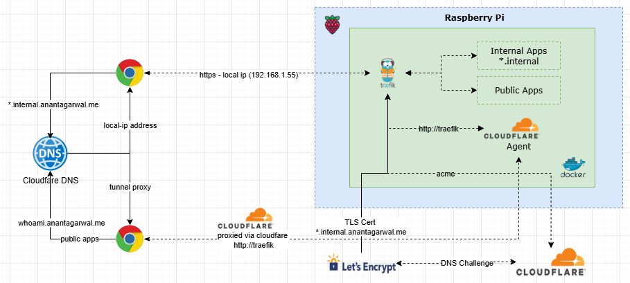
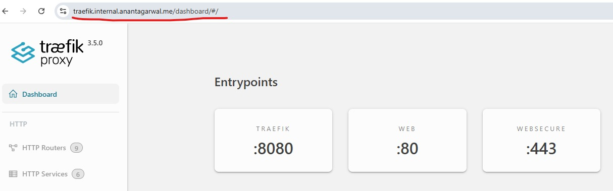

# Home Lab

My Home Lab running on a Raspberry Pi 5, managed with Docker Compose and Traefik as the reverse proxy.

## Architecture



- **Reverse proxy**: Traefik v3 with Cloudflare DNS challenge for wildcard TLS certs
- **Networking**: All services share the external `homelab-network` Docker bridge
- **DNS**: Internal services are accessible at `*.internal.anantagarwal.me`
- **Tunnel**: Cloudflare Tunnel exposes select services to the internet

## Managing the Stack

A helper script `hl` wraps all common operations. Make it executable once:

```bash
chmod +x ~/homelab/hl

# Optional: symlink to PATH so you can run it from anywhere
sudo ln -sf ~/homelab/hl /usr/local/bin/hl
```

### Commands

```bash
hl up                  # start everything
hl down                # stop everything
hl restart             # stop + start with orphan cleanup
hl update              # pull latest images and restart

hl up homarr           # start a single service
hl restart homarr      # restart a single service
hl update paperless    # update a single service

hl logs traefik        # follow logs (Ctrl-C to stop)
hl status              # show all running containers
hl exec paperless bash # open a shell in a container
```

Each service folder also contains its own `compose.yaml` for direct use:

```bash
docker compose -f traefik/compose.yaml up -d
```

## Services

### Internet Exposed

| Service | URL |
|---------|-----|
| Whoami (debug) | [whoami.anantagarwal.me](https://whoami.anantagarwal.me) |

### Internal (`*.internal.anantagarwal.me`)

| Service | URL | Description |
|---------|-----|-------------|
| Traefik | [traefik.internal.anantagarwal.me](https://traefik.internal.anantagarwal.me) | Reverse proxy dashboard |
| Homarr | [homarr.internal.anantagarwal.me](https://homarr.internal.anantagarwal.me) | Homelab dashboard |
| BentoPDF | [bentopdf.internal.anantagarwal.me](https://bentopdf.internal.anantagarwal.me) | Privacy-first PDF toolkit |
| Dockhand | [dockhand.internal.anantagarwal.me](https://dockhand.internal.anantagarwal.me) | Docker management UI |
| Paperless-NGX | [paperless.internal.anantagarwal.me](https://paperless.internal.anantagarwal.me) | Document management |



## Folder Structure

```
homelab/
├── compose-global.yaml      # top-level orchestrator
├── traefik/                 # Traefik + Cloudflare tunnel + whoami
│   ├── compose.yaml
│   ├── config/              # traefik static/dynamic config
│   └── certs/               # TLS certificates (gitignored)
├── homarr/                  # Homarr dashboard
│   ├── compose.yaml
│   └── .env.example
├── bentopdf/                # BentoPDF self-hosted
│   └── compose.yaml
├── dockhand/                # Dockhand Docker UI
│   └── compose.yaml
└── paperless-ngx/           # Paperless document management
    ├── compose.yaml
    ├── .env.example
    ├── consume/             # drop files here to auto-ingest
    └── export/              # paperless exports land here
```

## Secrets Setup

Services that require secrets use a `.env` file in their folder. Copy the example and fill in your values:

```bash
# Homarr — requires a 64-char hex encryption key
cp homarr/.env.example homarr/.env
echo "SECRET_ENCRYPTION_KEY=$(openssl rand -hex 32)" > homarr/.env

# Paperless-NGX — requires secret key + admin credentials
cp paperless-ngx/.env.example paperless-ngx/.env
nano paperless-ngx/.env
```

> **Note:** `.env` files are gitignored and should never be committed.
